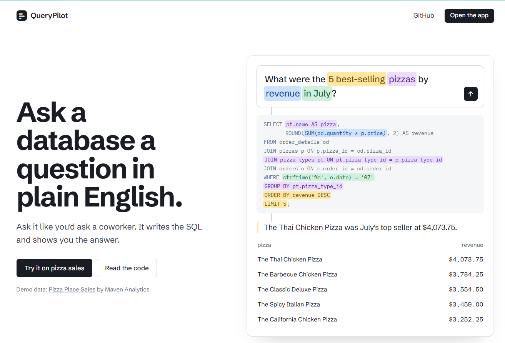
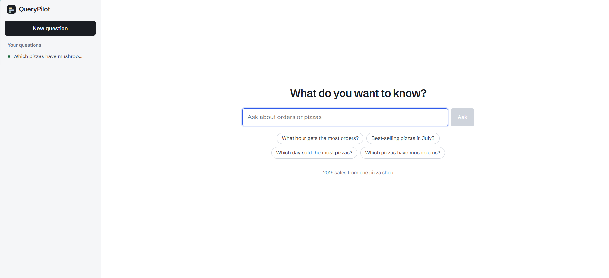

# QueryPilot

Ask questions about a pizza shop's 2015 sales in plain English and get back the answer, the SQL that found it, and the result as a table (or a bar chart when that fits).

Live demo: coming soon





## How it works

1. You type a question, like "What hour gets the most orders?"
2. The model gets the database schema (each `CREATE TABLE` with notes on how the data works, plus a few sample rows) and a short business glossary (`backend/data/glossary.md`) that says what words like "pizza", "sold" and "revenue" mean here.
3. It writes one `SELECT` query. If the data can't answer the question (profit, customers, delivery), it says so instead of guessing.
4. A guard built on `sqlglot` checks the query before anything runs.
5. The query runs on a read-only SQLite connection.
6. If it fails, the error goes back to the model and it tries again, up to 3 tries in total. The app shows every attempt.
7. A second, small model call reads the result and writes a one or two sentence answer in plain English.

## Results

There's a set of 30 questions in `backend/evals/questions.json` (8 easy, 10 medium, 10 hard, 2 that should be refused), each with a hand-written correct query. A question counts as right only when the agent's result rows match the correct query's rows (column names and order don't matter).

With gpt-4o-mini, execution accuracy is **96.7% averaged over 3 runs** (min 93.3%, max 100%).

To be honest about that number: the prompt and glossary were tuned against these same 30 questions, so a held-out set would likely score lower.

Run it yourself (needs an OpenAI key):

```bash
cd backend
python -m evals.run_eval --repeat 3
```

## Safety

The model writes SQL, so it shouldn't be able to break anything. Several layers make sure it can't:

- **Guard.** `sqlglot` parses the query and rejects anything that isn't a single read-only query: no `INSERT`, `UPDATE`, `DELETE`, `DROP`, `PRAGMA`, `ATTACH` or stacked statements.
- **Read-only connection.** The database file is opened in read-only mode with `query_only` on, so even a write that slipped past the guard would fail.
- **Timeout.** Queries are stopped after 3 seconds.
- **Row cap.** Results are capped at 200 rows, and the app tells you when it cut some off.

## Run it locally

**With Docker** (needs Docker Desktop running)

```bash
cp backend/.env.example backend/.env    # then add your OPENAI_API_KEY
docker compose up --build               # first time; after that just: docker compose up
```

Open http://localhost:5173.

**Without Docker**

Backend (Python 3.10+):

```bash
cd backend
python -m venv .venv && source .venv/bin/activate     # Git Bash on Windows: source .venv/Scripts/activate
pip install -r requirements.txt
cp .env.example .env                                   # then add your OPENAI_API_KEY
python -m data.seed                                    # builds data/shop.db from the CSVs
uvicorn app.main:app --reload                          # http://localhost:8000/docs
```

Frontend (Node 18+), in a second terminal:

```bash
cd frontend
npm install
npm run dev                                            # http://localhost:5173
```

Tests don't need an API key (a scripted fake model stands in for OpenAI):

```bash
cd backend && pytest -q
```

## Data

[Pizza Place Sales](https://mavenanalytics.io/data-playground/pizza-place-sales) by Maven Analytics (public domain): every order from 2015 at a fictional pizza shop, about 21,000 orders across 4 tables. The raw CSVs are in `backend/data/raw/`, and `backend/data/seed.py` loads them into SQLite.

## Tech stack

FastAPI, SQLite and sqlglot on the backend, React and Vite on the frontend, OpenAI (gpt-4o-mini by default) for the model.
