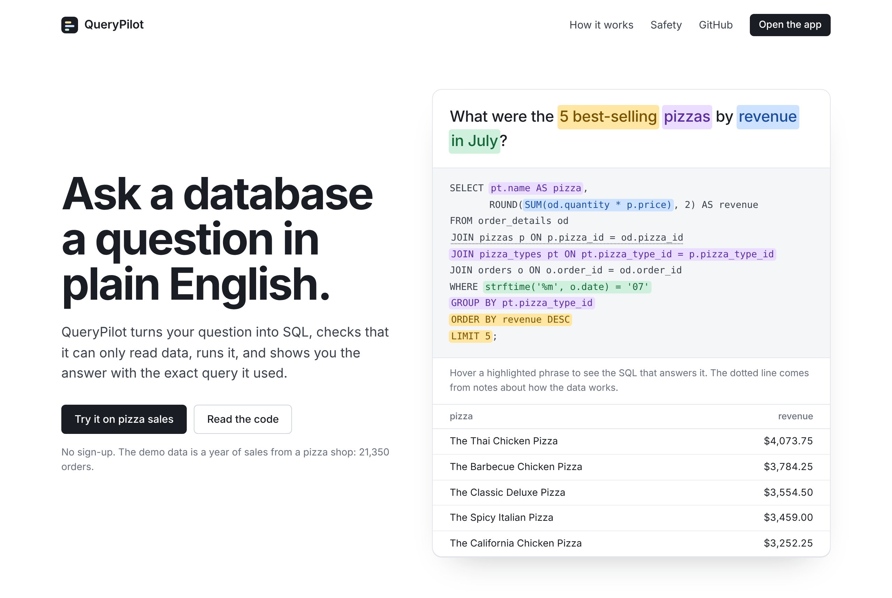
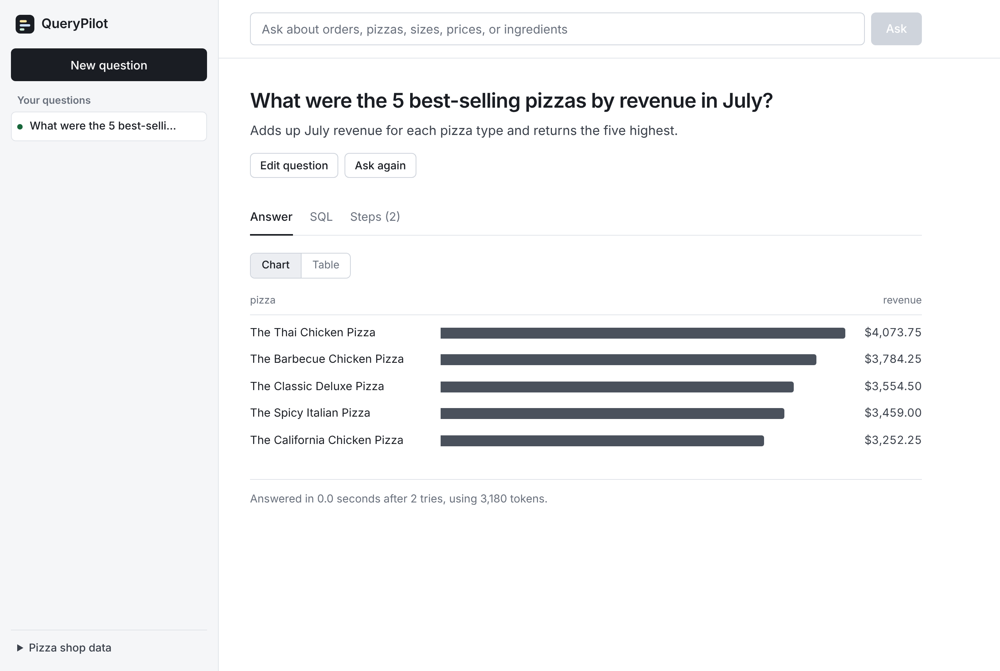

# QueryPilot

Ask questions about a database in plain English and get back the SQL, the answer, and a chart. The demo runs on a year of pizza shop sales: "What hour gets the most orders?" or "Which pizzas contain mushrooms?"

QueryPilot is a text-to-SQL agent. It shows the model the database schema, has it write a query, checks that the query is safe and read-only, runs it, and if the query fails, feeds the error back so the model can fix its own mistake.





## How it works

```
question ──► LLM writes SQL ──► guard (read-only? one statement? add LIMIT) ──► run on SQLite (read-only, timeout)
                 ▲                                                                       │
                 └──────────── error message fed back (up to 3 attempts) ◄───── error ───┘
```

- **Schema-aware prompting.** The model gets each table's `CREATE TABLE` statement (including inline comments that explain business rules such as "revenue = quantity × price" and "price depends on size, so it lives in the pizzas table") and a few sample rows.
- **Self-correction.** Syntax errors, unknown columns, and guard rejections go back to the model, which retries up to `MAX_ATTEMPTS` times. The UI shows every attempt.
- **Answers in plain English.** After the query runs, a second small model call reads the result and writes a one or two sentence answer ("July was the best month at $72,557.90…"). The UI also formats raw values for people: `2015-07` becomes "Jul 2015", money gets a `$`, hour `12` becomes "12 PM". Turn it off with `SUMMARIZE=false`.
- **Knows when to say no.** If the data can't answer the question (e.g. profit, when there is no cost data), the model returns `sql: null` and an explanation instead of making something up.
- **Layered safety.** `sqlglot` parses every query and rejects anything but a single `SELECT`/`WITH` (no `DROP`, `PRAGMA`, `ATTACH`, stacked statements). The database is also opened read-only with `query_only`, queries are interrupted after a time limit, and results are capped.

## Evaluation

`backend/evals/questions.json` holds 30 questions (easy / medium / hard / unanswerable), each with a hand-written gold SQL query. The eval runs the agent on every question and checks **execution accuracy**: whether the agent's result set matches the gold result set, ignoring column names and order.

```bash
cd backend
python -m evals.run_eval                    # default model
python -m evals.run_eval --model gpt-4o     # compare models
python -m evals.run_eval --only h01,h07     # rerun specific questions
```

It prints accuracy overall and by difficulty, how many answers needed self-correction, p50/p95 latency, and token usage, then saves a full per-question report to `evals/results/`.

| Model | Execution accuracy | Self-corrected | p50 latency |
|---|---|---|---|
| gpt-4o-mini | _run the eval_ | | |

## Run it locally

**Easiest: Docker** (needs Docker Desktop running)

```bash
cp backend/.env.example backend/.env    # then add your OPENAI_API_KEY
docker compose up --build               # first time; after that just: docker compose up
```

Open http://localhost:5173. Code changes in `backend/app/` and `frontend/src/` reload automatically. Stop with `Ctrl + C`, or run `docker compose down`. Rebuild with `--build` after changing `requirements.txt`, `package.json`, or the data.

**Without Docker**

**Backend** (Python 3.10+)

```bash
cd backend
python -m venv .venv && source .venv/bin/activate     # Git Bash on Windows: source .venv/Scripts/activate
pip install -r requirements.txt
cp .env.example .env                                   # then add your OPENAI_API_KEY
python -m data.seed                                    # builds data/shop.db from data/raw/*.csv
uvicorn app.main:app --reload                          # http://localhost:8000/docs
```

**Frontend** (Node 18+)

```bash
cd frontend
npm install
npm run dev                                            # http://localhost:5173
```

**Tests** (no API key needed; a scripted fake LLM stands in for OpenAI)

```bash
cd backend && pytest -q
```

## API

| Method | Path | Description |
|---|---|---|
| `POST` | `/api/query` | `{"question": "..."}` → plain-English answer, SQL, explanation, columns, rows, attempts, tokens, timings |
| `GET` | `/api/schema` | Tables, columns, and row counts |
| `GET` | `/api/examples` | Example questions for the UI |
| `GET` | `/api/health` | Health check |

## The demo data

[Pizza Place Sales](https://mavenanalytics.io/data-playground/pizza-place-sales) by Maven Analytics (public domain, CC0): every order from 2015 at a fictional pizza shop. The raw CSVs are in `backend/data/raw/`, and `backend/data/seed.py` loads them into SQLite.

| Table | Rows | What it holds |
|---|---|---|
| `orders` | 21,350 | Date and time of each order |
| `order_details` | 48,620 | Which pizzas (type + size) were in each order, and how many |
| `pizzas` | 96 | Each menu item: a pizza type in one size, with its price |
| `pizza_types` | 32 | Name, category (Classic, Chicken, Supreme, Veggie), and ingredients |

The loader fixes three quirks in the raw files, each covered by a test:

- **Dates are day/month/year** (`31/08/2015`), so `01/02/2015` is Feb 1. They're stored as ISO dates so SQLite's date functions and sorting work.
- **Times aren't zero-padded** (`9:52:21`), which breaks sorting and hour math. They're stored as `09:52:21`.
- **`pizza_types.csv` is Windows-1252**, so the curly quote in "'Nduja Salami" shows up as a broken character unless it's decoded properly.

Column notes in the schema come from the dataset's own data dictionary. Total revenue comes out to $817,860.05, matching the published figure for this dataset.

## Project layout

```
backend/
  app/
    main.py       FastAPI routes
    agent.py      generate → guard → run → retry loop
    guard.py      sqlglot safety checks + LIMIT
    db.py         read-only SQLite access, schema text, query timeout
    llm.py        OpenAI client + JSON parsing (swappable via the LLMClient protocol)
    prompts.py    system and retry prompts
  data/raw/       the original CSVs from Maven Analytics
  data/seed.py    loads the CSVs into SQLite, fixing dates, times, and encoding
  evals/          questions, scoring, eval runner
  tests/          pytest suite
frontend/
  src/pages/Landing.jsx     landing page (hero demo, how it works, safety, testing)
  src/pages/Workspace.jsx   the app: question history sidebar + result view
  src/components/           HeroDemo, ResultView, BarChart, ResultsTable, Logo
  src/content.js            copy, suggested questions, eval numbers to fill in
```

## Roadmap

- [ ] Run the eval, fill in the results table and `EVAL_RESULTS` in frontend/src/content.js
- [ ] Deploy (backend on Render or AWS, frontend on Vercel)
- [ ] Follow-up questions with conversation memory ("now only for large pizzas")
- [ ] Natural-language answer summary on top of the table
- [ ] Upload your own CSVs into a private, temporary database
- [ ] Postgres support
- [ ] Rate limiting on `/api/query` for the public demo
